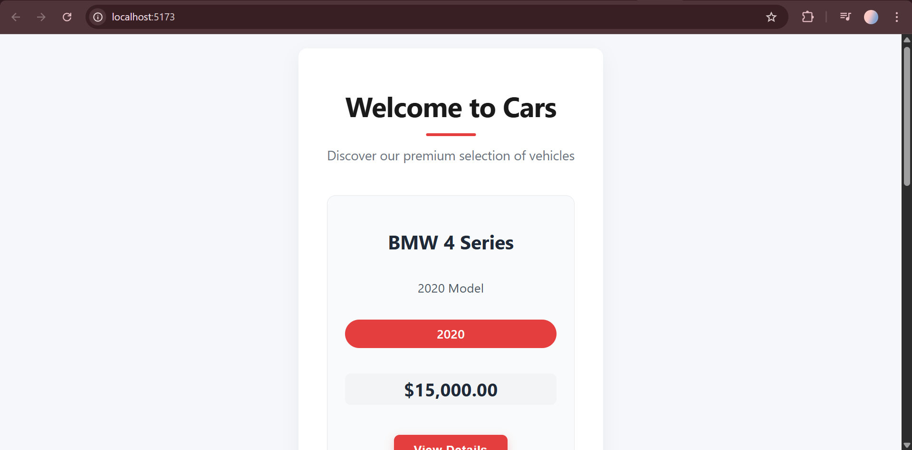

# PERN Car Catalog

A full-stack car catalog application built with the PERN stack.

## Tech Stack
- React (Vite)
- Node.js
- Express
- PostgreSQL
- Drizzle ORM

## Features
- Browse available cars
- RESTful API for car data
- PostgreSQL persistence
- Clean, responsive UI

## Project Structure
- `01_nodejs` – Node basics
- `02_expressjs` – Express API
- `03_postgresql` – Database + Drizzle ORM
- `04_reactjs` – Frontend

## Screenshots

## Notes
This project represents a buyer-facing storefront. Inventory management is handled via backend APIs and not exposed in the public UI.
